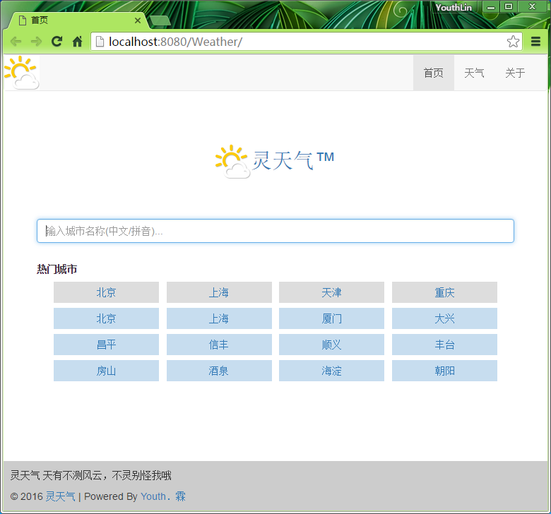
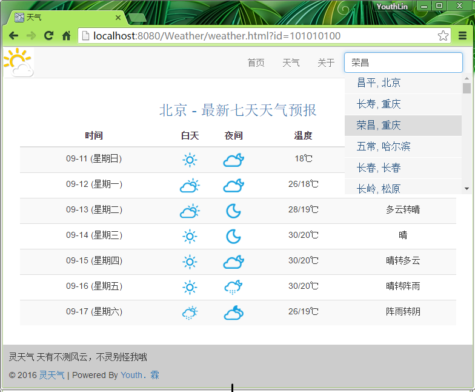
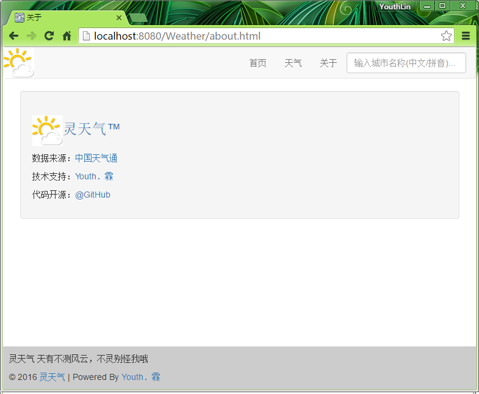

# 天气搜索网站

## 题目描述
搭建一个website，提供搜索功能，输入城市，
可以搜索出此城市的未来7天（含当天）的天气预报信息

## 要求
1. 定时从天气网（http://www.weather.com.cn/）
   抓取全国各主要城市的天气信息
2. 处理后保存至数据库（自选）
3. 搭建website，提供一个搜索页面，
   输入为城市名称（可提供输入提示功能），
   输出结果为此城市的天气预报信息"

## 项目搭建
1. **用到的技术:** Spring + Spring MVC + Hibernate + MySQL + 
              Tiles + jQuery + Bootstrap + Maven
2. **Spring:** 管理所有的 JavaBean. 根据配置的依赖关系自动注入。
3. **Spring MVC:** MVC 容器处理所有请求。
4. **Hibernate:** 持久化工具。
5. **MySQL:** 数据库。
6. **Tiles:** 实现前端页面的复用。
7. **jQuery:** Ajax 实现搜索提示。
8. **Bootstrap:** 前端 CSS 框架。
9. **Maven:** 构建工具。

## 数据库设计
city(*cityId*, cityName, stationName, provinceName, searchCount)  
weatherRecord(*day*, weatherDay, weatherNight, temperature, description, *cityId*, lastUpdate)  

  

## 流程
1. 在 http://m.weathercn.com/citychange.jsp?partner=m 
   获取城市数据，使用 `Jsoup` 解析页面并爬取城市数据保存在文件中。
   获取 省 - 市 - 县区 三级数据后，把数据插入到数据库。
2. 完成搜索提示。部分代码来自 http://m.weathercn.com/js/citysearch.js 
3. 天气预报。若数据库中有最新记录则直接取出，否则爬取最新天气数据。
4. 爬取天气数据。http://m.weathercn.com/index.do?id=xxx 解析后存入数据库。
5. 天气图标。因为获取的天气数据是图标，因此本项目也使用相同的图标。
   [使用批处理+curl下载全部图标](http://youthlin.com/?p=1288)
6. **热门城市。** 记录了每个城市搜索次数，在首页实时展示热搜城市。

## 截图
1. 首页 - Home   
2. 搜索提示 - Search Hint   
3. 预报页面 - Weather Page   
4. 关于页面 - About Page   

## 其他
项目源代码：https://github.com/YouthLin/Weather
